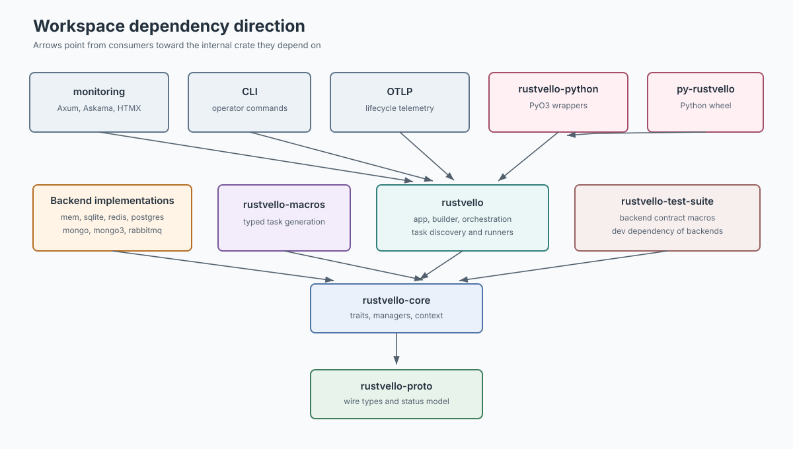
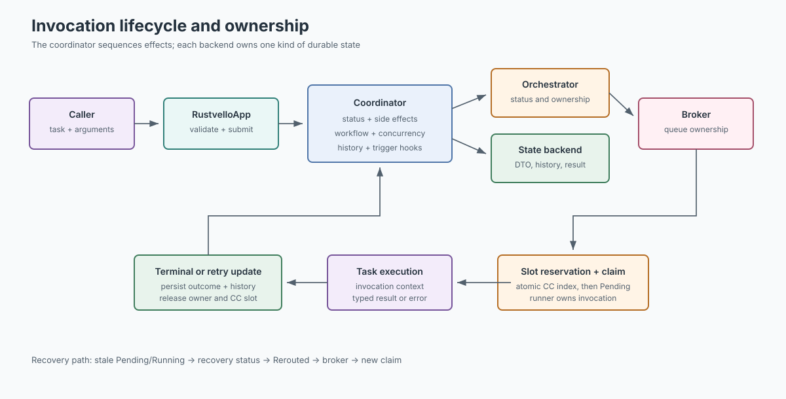
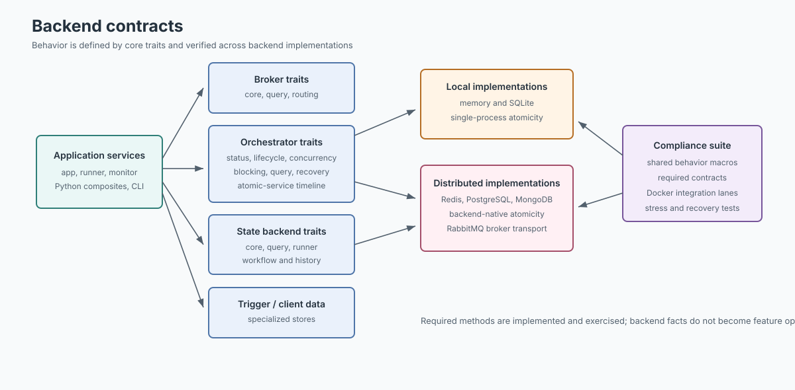
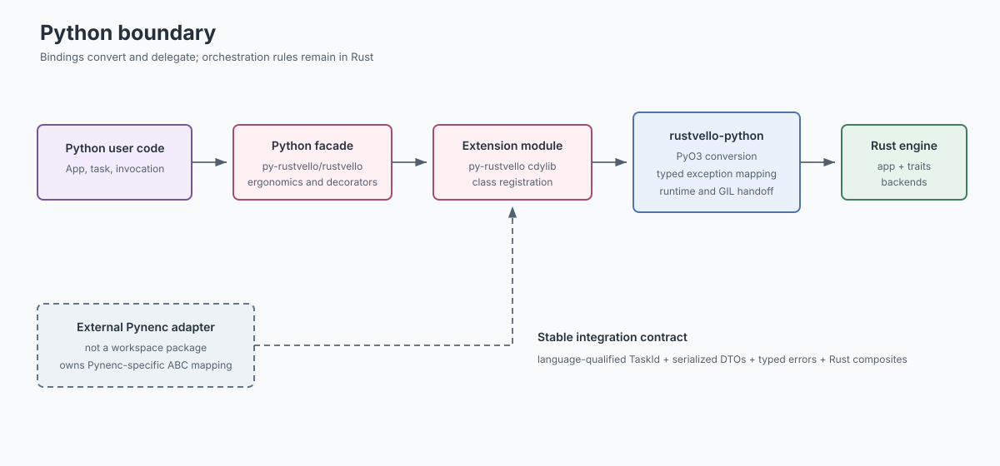
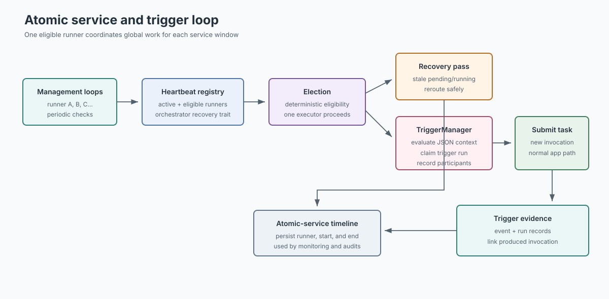
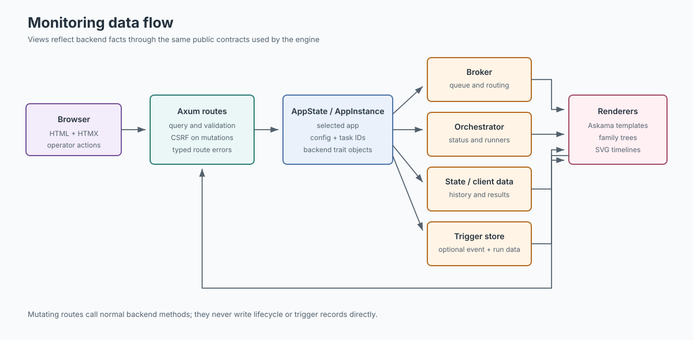
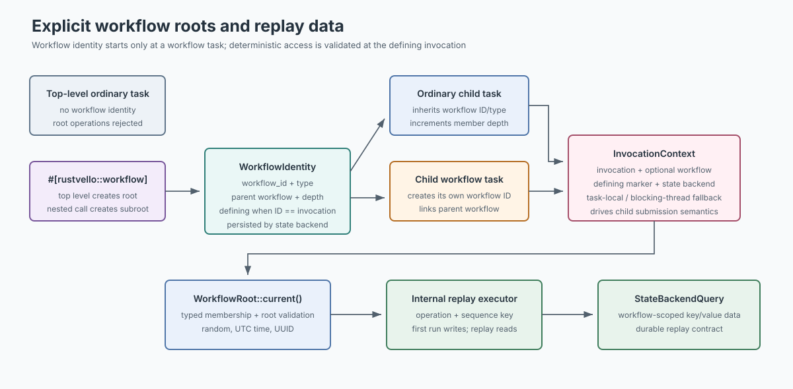
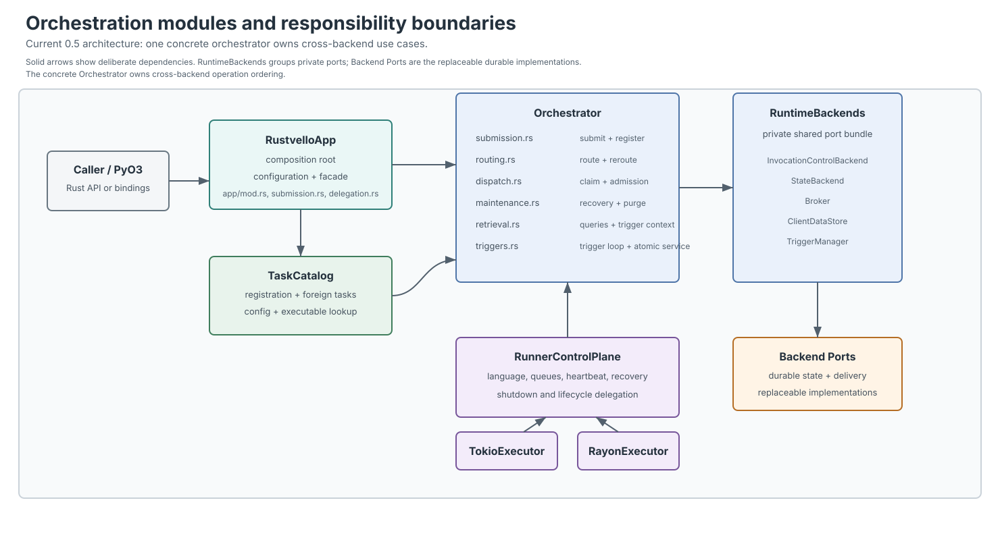

# Architecture

Rustvello is organized as a Rust workspace of 16 crates with focused responsibilities.
This page describes how they fit together, the data model, core trait signatures,
the invocation state machine, and the cross-language design.

---

## Pynenc Integration

Rustvello also integrates with [Pynenc](https://docs.pynenc.org) as an optional high-performance
backend plugin. While this page documents Rustvello's internal Rust design, Python users who access
Rustvello through Pynenc can refer to the [Pynenc Architecture Docs](https://pynenc.github.io/architecture/index.html)
for the Python perspective.

The Pynenc-specific adapter is an external consumer of Rustvello's Python and
wire contracts; it is not a crate or Python package in this repository.

## Architecture Maps

These static maps summarize the ownership and data-flow boundaries described
in the sections below. They are maintained as documentation assets rather than
generated from runtime code.



Workspace dependency direction.



Submission, execution, persistence, and recovery ownership.



Backend contracts and deployment boundaries.



Python and external Pynenc integration boundaries.



Global service election, recovery, and trigger evaluation.



Monitoring reads and operator actions.



Explicit workflow identity and root-scoped deterministic data behavior.



Concrete orchestration, backend ports, task catalog, and runner control plane after the 0.5 refactor.

## Crate Dependency Graph

```text
rustvello-proto              Pure data types — DTOs, identifiers, config, status FSM
    │
rustvello-core               Trait definitions + business logic managers
    │                        Broker, InvocationControlBackend, StateBackend, TriggerStore,
    │                        ClientDataStore, Task, DynTask, InvocationHandle,
    │                        TriggerManager, Context system
    │
    ├── rustvello-mem         In-memory implementations (dev/testing)
    ├── rustvello-sqlite      SQLite implementations (single-host production)
    ├── rustvello-redis       Redis implementations (distributed)
    ├── rustvello-postgres    PostgreSQL trigger store
    ├── rustvello-mongo       MongoDB implementations (driver v3)
    ├── rustvello-mongo3      MongoDB implementations (driver v2 — legacy)
    ├── rustvello-rabbitmq    RabbitMQ broker
    │
rustvello-macros              #[rustvello::task] proc-macro — zero-cost compile-time
    │                         task registration via inventory crate
    │
rustvello                     Application layer — RustvelloApp, RustvelloBuilder,
    │                         TaskRunner, TriggerBuilder, TaskRegistry,
    │                         auto-discover via inventory::collect!
    │
    ├── rustvello-monitoring  Web dashboard (Axum + Askama + HTMX + SVG)
    ├── rustvello-prometheus  Prometheus EventEmitter implementation
    ├── rustvello-test-suite  Macro-generated backend compliance tests
    │
    ├── rustvello-python      PyO3 #[pyclass] wrappers (Rust → Python bridge)
    │
    └── rustvello-cli         CLI binary (rustvello run / status / list / purge / info / config)

py-rustvello/ (Python wheel — cdylib built with maturin)
    └── rustvello Python package — exposes PyO3-wrapped Rust backends

external Pynenc adapter (separate distribution/repository)
    └── consumes py-rustvello and maps Pynenc interfaces to Rustvello contracts
```

---

## Python Integration Architecture

Rustvello powers Python applications through a three-layer architecture.
Each layer has a single responsibility:

```text
┌─────────────────────────────────────────────┐
│            User Python Code                 │
│   app = PynencBuilder().rustvello_redis()   │
│                    .build()                 │
└──────────────────┬──────────────────────────┘
                   │ pynenc ABC interface
┌──────────────────▼──────────────────────────┐
│          pynenc-rustvello                   │
│   Python adapters (broker.py, orchestrator. │
│   py, state_backend.py, trigger.py, ...)    │
│   Stateless bridges: type conversion only   │
└──────────────────┬──────────────────────────┘
                   │ PyO3 bindings
┌──────────────────▼──────────────────────────┐
│          py-rustvello (rustvello wheel)      │
│   PyO3-exposed Rust structs:                │
│   RustMemBroker, RustRedisBroker, ...       │
└──────────────────┬──────────────────────────┘
                   │ Rust trait calls
┌──────────────────▼──────────────────────────┐
│          rustvello-core / rustvello-mem /    │
│          rustvello-redis / ...              │
│   Pure Rust implementations                 │
└─────────────────────────────────────────────┘
```

| Layer           | Package                                                        | Knows about pynenc?         | Contains logic?       |
| --------------- | -------------------------------------------------------------- | --------------------------- | --------------------- |
| Rust core       | `rustvello` (crates)                                           | No                          | All logic lives here  |
| PyO3 bindings   | `rustvello` (wheel)                                            | No                          | Type conversion only  |
| Python adapters | [`pynenc-rustvello`](https://pynenc-rustvello.readthedocs.io/) | Yes — satisfies pynenc ABCs | No — stateless bridge |
| Framework       | `pynenc`                                                       | No rustvello knowledge      | Plugin discovery only |

---

## Data Model (`rustvello-proto`)

### Identifiers

| Type                  | Structure                                  | Purpose                                                                 |
| --------------------- | ------------------------------------------ | ----------------------------------------------------------------------- |
| `TaskId`              | `{ language: TaskLanguage, module, name }` | Uniquely identifies an executable definition as `language::module.name` |
| `CallId`              | `{ task_id: TaskId, args_id: String }`     | Deterministic identity for task + args (SHA-256 of serialized args)     |
| `InvocationId`        | newtype `String` (UUID v4)                 | Unique execution instance                                               |
| `RunnerId`            | newtype `String` (UUID v4)                 | Identifies a runner process                                             |
| `ConditionId`         | newtype `String` (SHA-256)                 | Identifies a trigger condition                                          |
| `TriggerDefinitionId` | newtype `String` (SHA-256)                 | Identifies a trigger definition                                         |

### Invocation Status — Finite State Machine

```{mermaid}
graph TD
    Start(( )) -->|init| Registered

    Registered -->|schedule| Pending
    Registered -->|concurrency check| CC[ConcurrencyControlled]
    Registered -->|limit reached| CCFinal[ConcurrencyControlledFinal]

    CC -->|re-queue| Rerouted
    Rerouted -->|schedule| Pending
    Rerouted -->|still controlled| CC

    Pending -->|run| Running
    Pending -->|crash / OOM| Killed
    Pending -->|re-route| Rerouted
    Pending -->|timeout| PR[PendingRecovery]

    PR -->|re-queue| Rerouted

    Running -->|complete| Success
    Running -->|error| Failed
    Running -->|crash / OOM| Killed
    Running -->|retry| Retry
    Running -->|suspend| Paused
    Running -->|timeout| RR[RunningRecovery]

    RR -->|re-queue| Rerouted

    Paused -->|continue| Running
    Paused -->|crash / OOM| Killed

    Killed -->|re-queue| Rerouted

    Retry -->|schedule| Pending

    Success --> End(( ))
    Failed --> End
    CCFinal --> End

    classDef available fill:#22863a,color:#fff,stroke:#1a6e2e,stroke-width:2px
    classDef execution fill:#6f42c1,color:#fff,stroke:#5a32a3,stroke-width:2px
    classDef recovery fill:#e36209,color:#fff,stroke:#c55404,stroke-width:2px
    classDef queue fill:#0366d6,color:#fff,stroke:#025ab5,stroke-width:2px
    classDef termFail fill:#cb2431,color:#fff,stroke:#a91d28,stroke-width:2px
    classDef termSuccess fill:#28a745,color:#fff,stroke:#1e7e34,stroke-width:2px
    classDef point fill:#586069,color:#fff,stroke:#586069

    class Registered,Rerouted,Retry available
    class Running,Paused execution
    class PR,RR,Killed recovery
    class Pending,CC queue
    class Failed,CCFinal termFail
    class Success termSuccess
    class Start,End point
```

**Colour legend** —
🟢 Green: available for run (Registered, Rerouted, Retry) ·
🟣 Purple: execution (Running, Paused) ·
🟠 Orange: recovery / kill (PendingRecovery, RunningRecovery, Killed) ·
🔵 Blue: queued (Pending, ConcurrencyControlled) ·
🔴 Red: terminal failure (Failed, ConcurrencyControlledFinal) ·
✅ Green: terminal success (Success)

13 states. Terminal states: `Success`, `Failed`, `ConcurrencyControlledFinal`.
`Killed` and `Rerouted` are **not** terminal — they re-enter the lifecycle via `Rerouted` → `Pending`.
Transitions are validated by `InvocationStatus::valid_transitions()` at runtime.

Mermaid source: [`_static/invocation-status-fsm.mmd`](_static/invocation-status-fsm.mmd)

### Configuration

| Struct                  | Key Fields                                                                                                                                                     |
| ----------------------- | -------------------------------------------------------------------------------------------------------------------------------------------------------------- |
| `AppConfig`             | `app_id`, `dev_mode_force_sync`, `max_pending_seconds`, `heartbeat_interval_seconds`, `runner_dead_after_seconds`, `recovery_check_interval_seconds`           |
| `TaskConfig`            | `max_retries`, `concurrency_control`, `running_concurrency`, `registration_concurrency`, `key_arguments`, `cache_results`, `is_workflow_task`, `reroute_on_cc` |
| `ClientDataStoreConfig` | `disabled`, `min_size_to_cache`, `max_size_to_cache`, `local_cache_size`, `warn_threshold`                                                                     |

---

## Core Traits (`rustvello-core`)

All core traits are `Send + Sync` and use `#[async_trait]` for object safety with
`Arc<dyn Trait>` dispatch.

### Broker

Routes invocations into queues and retrieves the next one for a worker.

```rust
pub trait Broker: Send + Sync {
    async fn route_invocation(&self, invocation_id: &InvocationId) -> RustvelloResult<()>;
    async fn retrieve_invocation(&self, task_id: Option<&TaskId>) -> RustvelloResult<Option<InvocationId>>;
    async fn retrieve_invocation_for_language(
        &self, language: &str, task_id: Option<&TaskId>
    ) -> RustvelloResult<Option<InvocationId>>;
    async fn purge(&self) -> RustvelloResult<()>;
}
```

### InvocationControlBackend

Persists atomic invocation control decisions: lifecycle transitions, execution
ownership, concurrency indexes, wait graphs, heartbeats, and recovery claims.
It does not publish work or persist calls, results, or history.

```rust
pub trait InvocationControlBackend: Send + Sync {
    // Lifecycle
    async fn register_invocation(&self, call: &CallDTO, id: &InvocationId) -> RustvelloResult<()>;
    async fn set_invocation_status(
        &self, id: &InvocationId, status: InvocationStatus, runner_id: Option<&RunnerId>
    ) -> RustvelloResult<()>;
    async fn get_invocation_status(&self, id: &InvocationId) -> RustvelloResult<InvocationStatusRecord>;

    // Concurrency control
    async fn check_concurrency_control(
        &self, task_id: &TaskId, config: &TaskConfig, cc_args: Option<&SerializedArguments>
    ) -> RustvelloResult<bool>;

    // Recovery
    async fn register_heartbeat(&self, runner_id: &RunnerId) -> RustvelloResult<()>;
    async fn get_stale_pending_invocations(&self, max_pending_seconds: f64) -> RustvelloResult<Vec<InvocationId>>;
    async fn get_stale_running_invocations(&self, runner_dead_after_seconds: f64) -> RustvelloResult<Vec<InvocationId>>;
}
```

### StateBackend

Stores and retrieves task results and errors.

```rust
pub trait StateBackend: Send + Sync {
    async fn set_result(&self, id: &InvocationId, result: &str) -> RustvelloResult<()>;
    async fn get_result(&self, id: &InvocationId) -> RustvelloResult<Option<String>>;
    async fn set_error(&self, id: &InvocationId, error: &str) -> RustvelloResult<()>;
    async fn get_error(&self, id: &InvocationId) -> RustvelloResult<Option<String>>;
}
```

### TriggerStore

Stores trigger definitions, condition matches, execution claims, and durable
monitoring evidence. All trigger methods are required for every full trigger
backend. `EventRecord` and `TriggerRunRecord` are persisted and queried through
the backend's native storage primitives; the shared evidence contract has no
unsupported implementation path. RabbitMQ is a broker-only component and does
not expose a trigger store.

The stable monitoring DTOs live in `rustvello-proto`. Events retain payload,
emitter, matched-condition, and produced-invocation links. Trigger runs retain
arguments, timestamps, the produced invocation, and one participant entry per
condition source.

---

## Application Layer (`rustvello`)

### Orchestration Boundaries

The concrete `Orchestrator` is the application service that sequences complete
invocation use cases. `InvocationControlBackend` is the replaceable persistence
port for authoritative control state. The names now describe their boundaries:
the backend controls atomic invocation state, while the concrete orchestrator
orders multi-port application operations.

| Component                  | Owns                                                                                                 | Must not own                                                        |
| -------------------------- | ---------------------------------------------------------------------------------------------------- | ------------------------------------------------------------------- |
| `InvocationControlBackend` | Status FSM, execution ownership, concurrency indexes, wait graph, runner heartbeats, recovery claims | Invocation payloads/results/history, broker delivery, task registry |
| `StateBackend`             | Calls, invocation DTOs, results, exceptions, history, workflow data                                  | Status-transition authority, queue delivery                         |
| `Broker`                   | Pending delivery and queue/priority ordering                                                         | Invocation lifecycle or result state                                |
| concrete `Orchestrator`    | Ordering and error propagation for cross-backend use cases                                           | Durable state of its own, task definitions, backend-specific policy |
| `TaskCatalog`              | Registration, foreign declarations, executable lookup, effective task configuration                  | Invocation lifecycle and worker scheduling                          |
| `RustvelloApp`             | Configuration, task catalog, public application API, composition                                     | Backend implementation details                                      |

```text
RustvelloApp (public facade and composition root)
    |-- TaskCatalog (definitions, language, config, executable lookup)
    `-- Orchestrator (cross-backend use cases; owns no durable state)
          |-- InvocationControlBackend  atomic control-state operations
          |-- StateBackend              calls, outcomes, and history
          |-- Broker                    language/queue work delivery
          |-- ClientDataStore           large argument/result payloads
          `-- TriggerManager            trigger evidence and evaluation

Runner process
    `-- RunnerControlPlane (language, dispatch, heartbeat, recovery, shutdown)
          |-- Orchestrator (claim and invocation lifecycle use cases)
          |-- TaskCatalog (local executable lookup)
          `-- TaskExecutor
                |-- TokioExecutor (direct or bounded spawn_blocking)
                `-- RayonExecutor (bounded dedicated pool)
```

The concrete orchestrator modules are split by use case:

| Module           | Responsibility                                                         |
| ---------------- | ---------------------------------------------------------------------- |
| `backends.rs`    | Private `RuntimeBackends` bundle of shared backend ports               |
| `submission.rs`  | Submit/register use cases, workflow identity, runner-context history   |
| `routing.rs`     | Caller-owned routing, registration concurrency, and explicit rerouting |
| `dispatch.rs`    | Queue polling, language-aware retrieval, and execution admission       |
| `maintenance.rs` | Retry, recovery, auto-purge, and helper maintenance operations         |
| `retrieval.rs`   | Query helpers and trigger context lookup                               |
| `triggers.rs`    | Trigger-loop execution and atomic global service scheduling            |

For example, `InvocationControlBackend::set_invocation_status` atomically
validates and stores one control-state transition. The concrete orchestrator's
corresponding operation also records history, releases waiters, schedules
auto-purge, and reports the transition to triggers. Those effects do not belong
inside a persistence adapter because they span several ports.

The concrete orchestrator is therefore the use-case boundary, while the
control backend remains an atomic persistence boundary. `RustvelloApp` methods
are thin facade methods on one Rust type, even though their `impl` blocks are
split across focused source files.

Orchestration operations are not distributed transactions. Only operations
explicitly guaranteed by an individual backend are atomic. A composite may
partially complete if a later backend call fails, so its steps must remain
retryable and idempotent where practical.

Broker delivery is at least once. `route_call`, which accepts a caller-owned
`InvocationId`, can be retried with the same ID after a publication failure;
control and state writes are upserts. A broker acknowledgement lost after a
successful publish can still produce duplicate messages, so atomic execution
ownership is the final duplicate-execution guard. A transactional outbox would
be required to make persistence and publication one atomic operation.

### `RustvelloApp`

The central public facade and composition root. It owns configuration and the
task catalog, constructs the runtime services, and exposes ergonomic submission
and execution methods. Analogous to pynenc's `Pynenc` class.

```rust
let app = Rustvello::builder()
    .app_id("my-app")
    .from_env()          // RUSTVELLO__* env vars
    .from_file("config.toml")
    .auto_discover_tasks()  // collects all #[rustvello::task] via inventory
    .build().await?;
```

### `#[rustvello::task]` Macro

The `#[rustvello::task]` attribute macro transforms a plain function into a typed,
serializable task with compile-time registration:

```rust
#[rustvello::task(max_retries = 3, concurrency = "arguments")]
fn process(data: String) -> String {
    data.to_uppercase()
}
// Generates: ProcessParams { data: String }, ProcessTask (impl Task)
```

Supported attributes:

| Attribute                  | Type     | Description                                                          |
| -------------------------- | -------- | -------------------------------------------------------------------- |
| `max_retries`              | `u32`    | Retry attempts on failure                                            |
| `module`                   | `&str`   | Override the module component of `TaskId`                            |
| `concurrency`              | `&str`   | `"unlimited"` \| `"task"` \| `"argument"` \| `"none"`                |
| `registration_concurrency` | `&str`   | Registration-time dedup mode                                         |
| `key_arguments`            | `[&str]` | Argument names used as concurrency key                               |
| `cache_results`            | `bool`   | Cache results for identical args                                     |
| `is_workflow_task`         | `bool`   | Workflow marker set by the workflow macro or adapters                |
| `reroute_on_cc`            | `bool`   | Reroute when hitting concurrency limits                              |
| `blocking`                 | `bool`   | Move potentially blocking synchronous work off Tokio runtime threads |

### Runner Control Plane and Executors

Every runner has an immutable `TaskLanguage` and `ExecutorKind`. Shared process
behavior lives in `RunnerControlPlane`: language/queue polling, concurrency
admission, heartbeat, stale-work recovery, trigger evaluation, cancellation,
and graceful shutdown. A `TaskExecutor` implementation owns only bounded local
execution of task code.

```text
PersistentTokioRunner (default)       RayonRunner (dedicated CPU fleet)
             |                                      |
             +---------- RunnerControlPlane --------+
                              |
                    Orchestrator::claim_next
                              |
             physical <language, logical queue>
                              |
                    admitted invocation
                              |
                 +------------+------------+
                 |                         |
          TokioExecutor              RayonExecutor
       direct / spawn_blocking       bounded Rayon pool
```

`PersistentTokioRunner` is the general-purpose default. Its executor runs short
synchronous callbacks directly and sends tasks configured with `blocking = true`
to Tokio's bounded blocking pool. `RayonRunner` remains an explicit deployment
choice for CPU-focused logical queues. Rayon schedules independent invocation
closures; it does not split one invocation's input unless task code itself uses
Rayon parallel iterators, `join`, or `scope`.

The public runner set is intentionally small. `PersistentTokioRunner` is the
default and covers general workloads, including `blocking = true` tasks through
Tokio's blocking pool. `RayonRunner` is available for dedicated CPU-focused
logical queues. The previous per-invocation Tokio and always-blocking runner
surfaces were removed before 0.5 because they did not add a clear execution
model beyond those two supported choices.

---

## Cross-Language Architecture

Rustvello supports multi-language deployments where Python ([pynenc](https://docs.pynenc.org))
and Rust workers share the same broker and orchestrator under one `app_id`.

### Language-Qualified TaskId

Each `TaskId` carries a `language` field:

```text
rust::my_crate.add       ← Rust task (handled by Rust workers)
python::my_module.add    ← Python task (handled by Python workers)
```

### Routing

The broker maintains a separate physical execution lane for each language and
logical queue. Each worker fetches only from its immutable language via
`retrieve_invocation_for_language()`. Native queue brokers such as RabbitMQ use
separate physical queues; database-backed brokers may use indexed partitions.
This keeps Rust workers and Python workers isolated while sharing lifecycle and
result state.

### Wire Format

Cross-language calls use a canonical `BTreeMap<String, String>` format (JSON-encoded
values, deterministic key order) that both languages produce and consume identically.
The SHA-256 `args_id` algorithm is identical in both runtimes.

---

## Crate Descriptions

### `rustvello-mem`

In-memory implementations using `tokio::sync::Mutex<HashMap>` and `VecDeque`.
Suitable for development, testing, and single-process use. Zero external dependencies.

### `rustvello-sqlite`

SQLite-backed implementations via `rusqlite`. Suitable for single-host deployments
where data must outlive the process. Compiles `libsqlite3` statically — no system
library required.

### `rustvello-redis`

Redis-backed broker, orchestrator, and state backend via `redis-rs`. Uses pipelining
and `MGET` batching to minimize round trips. Suitable for distributed multi-host deployments.

### `rustvello-monitoring`

Axum web server with Askama HTML templates and HTMX for live updates. Features:

- **SVG timeline** — visualizes invocation schedules across runners and workers
- **Log explorer** — full-text log search with cross-entity highlighting
- **Invocation tables** — filterable by status, task, runner, time range
- **Workflow view** — parent/child invocation trees
- **Trigger evidence** — event list/detail and trigger-run participants
- **Prometheus endpoint** — `/metrics` when `rustvello-prometheus` is active

### `rustvello-prometheus`

Implements `EventEmitter` using the `metrics` crate facade. Bridges rustvello lifecycle
events to Prometheus counters and histograms without a hard runtime dependency.

### `rustvello-test-suite`

A single macro call generates the full compliance test suite for any backend:

```rust
rustvello_test_suite::suite_all!(MyBroker, MyOrchestrator, MyStateBackend);
```

Covers broker routing, orchestrator FSM, concurrency control, recovery, and
cross-language queue routing.

### `py-rustvello`

The maturin-built cdylib that produces the actual `rustvello` Python module. It depends on `rustvello-python` and enables the `extension-module` feature.

## Pynenc Framework

The pure-Python [pynenc](https://github.com/pynenc/pynenc) framework is a
separate repository and provides:

- Task decorators (`@app.task`)
- Builder API (`PynencBuilder`)
- Triggers and scheduling
- Monitoring (pynmon)

Pynenc can use Rustvello through an external adapter package. That adapter maps
the Rust-backed `Broker`, `Orchestrator`, and `StateBackend` to Pynenc's abstract
interfaces; no Pynenc-specific bridge classes live under `py-rustvello`.

## Composite Operations

:::{admonition} See also: Pynenc Docs
:class: seealso
To see how these composites are used by the native Python orchestrator, see [Pynenc Architecture: Composites](https://pynenc.github.io/architecture/composites.html).
:::

Composite operations bundle multiple trait calls (orchestrator, state backend,
history, trigger store, waiter, autopurge) into a single method. They are
implemented by the concrete `Orchestrator` application service and
are the mechanism that enables native-mode orchestration in the pynenc Python
binding.

### Why Composites?

Without composites, each orchestration step requires a separate FFI call from
Python → Rust, each acquiring and releasing the GIL. Composites reduce this to
a single FFI call per orchestration operation:

```text
Without composites (mixed mode):
  Python ──FFI──▶ check_concurrency()
  Python ──FFI──▶ set_status()
  Python ──FFI──▶ update_history()
  Python ──FFI──▶ evaluate_triggers()
  Python ──FFI──▶ notify_waiters()

With composites (native mode):
  Python ──FFI──▶ set_invocation_status_full()  ← all 5 steps in one call
```

### Coordinator Hot-Path Composites

The 5 hot-path composites cover the most frequently executed orchestration paths:

| Method                          | Description                                                                    |
| ------------------------------- | ------------------------------------------------------------------------------ |
| `register_invocations_full`     | Register invocation + concurrency check + route to broker + record history     |
| `set_invocation_status_full`    | Status change + history + trigger evaluation + waiter notification + autopurge |
| `get_invocations_to_run_full`   | Retrieve from broker + set to Running + record history                         |
| `set_invocation_result_full`    | Store result + set Success + history + triggers + waiters                      |
| `set_invocation_exception_full` | Store error + set Failed/Retry + history + triggers                            |

### Extended Composites

Additional composites for less frequent but still critical operations:

| Method                     | Description                                                              |
| -------------------------- | ------------------------------------------------------------------------ |
| `route_call()`             | Task submission: register + concurrency check + broker route in one call |
| `set_invocation_retry()`   | Retry handling: update status + re-enqueue + history                     |
| `check_atomic_services()`  | Recovery: detect stale invocations + re-queue + trigger evaluation       |
| `trigger_loop_iteration()` | Evaluate all pending trigger conditions in one pass                      |

---

## Dual-Mode Architecture

:::{admonition} See also: Pynenc Docs
:class: seealso
For details from the Python perspective, see [Pynenc Architecture: Dual Mode](https://pynenc.github.io/architecture/dual-mode.html).
:::

Rustvello supports two orchestration modes when used from Python (pynenc):

### Mixed Mode

Python's `BaseOrchestrator` drives coordination. Each orchestration step is a
separate FFI call into the Rust engine. Use when mixing Python and Rust backends.

### Native Mode

A single FFI call executes the entire coordination operation inside Rust using
composites. The GIL is released for the entire duration. Use for production.

### Mode Selection

Mode selection is configuration-driven:

- Choosing a `*NativeOrchestrator` class (for example `RustSqliteNativeOrchestrator`)
  enables composite orchestration calls for hot paths.
- Runner-loop delegation uses `Pynenc.is_all_rust_native`, which checks that
  all configured backend class names start with `Rust`
  (`orchestrator_cls`, `state_backend_cls`, `broker_cls`, `trigger_cls`,
  `client_data_store_cls`).

See the [pynenc architecture docs](https://docs.pynenc.org/architecture/) for details.

### Class Hierarchy (Python side)

```text
BaseOrchestrator (ABC)
  └── _RustvelloOrchestrator (mixed mode — multiple FFI calls per operation)
        └── _RustvelloNativeOrchestrator (native mode — single composite FFI call)
```

---

## Trigger Condition Model

The trigger system supports 6 condition types, all evaluated natively in Rust:

### Condition Types

| Type        | Description                               | Example                          |
| ----------- | ----------------------------------------- | -------------------------------- |
| `Cron`      | Time-based schedule                       | `"0 9 * * MON-FRI"`              |
| `Status`    | Fires when an invocation reaches a status | `{InvocationStatus::Success}`    |
| `Event`     | Fires on a named application event        | `"order.created"`                |
| `Result`    | JSON match against a task result          | `{"status": "done"}`             |
| `Exception` | Fires on one or more exception type names | `"TimeoutError"`                 |
| `Composite` | AND/OR combination of other conditions    | `CompositeCondition::All([...])` |

### Argument and Result Filters

All filters are JSON-only — no callables, no pickle, no lambdas. This restriction
enables Rust-native evaluation without Python callbacks:

- **`argument_filter`** — static JSON values provided at trigger definition time
- **`result_filter`** — JSON object matched against the task result

### `CompositeCondition`

Composite conditions combine multiple conditions with boolean logic:

```rust
CompositeCondition::All(vec![
    Condition::Status(task_a, InvocationStatus::Success),
    Condition::Status(task_b, InvocationStatus::Success),
])

CompositeCondition::Any(vec![
    Condition::Status(task_a, InvocationStatus::Failed),
    Condition::Event("manual_override".into()),
])
```

### Evaluation Flow

1. The management loop calls `trigger_loop_iteration()` in native mode.
2. Rust iterates all registered trigger conditions.
3. Each condition is checked against current state.
4. A deterministic execution claim prevents duplicate runs across runners.
5. Supporting stores persist the run and its condition participants.
6. Matching triggers create new invocations with the specified static arguments.
7. The run and participating events are linked to the created invocation.

Custom events are persisted before matching, so unmatched events remain
observable. Monitoring writes are part of the trigger-store contract and use
backend-native persistence. See
{doc}`monitoring/triggers` for record fields, filters, and dashboard behavior.

---

## Error Hierarchy

### `RustvelloError` Enum

The `RustvelloError` enum defines all error variants in the Rust engine:

| Variant                                                    | Description                                                             |
| ---------------------------------------------------------- | ----------------------------------------------------------------------- |
| `Retry`                                                    | Explicit retry requested                                                |
| `ConcurrencyRetry`                                         | Concurrency control requested a retry                                   |
| `TaskNotFound` / `TaskNotRegistered` / `TaskClassNotFound` | Task resolution and registry errors                                     |
| `InvocationNotFound`                                       | Invocation ID does not exist                                            |
| `InvalidStatusTransition`                                  | Status transition violates the FSM                                      |
| `OwnershipViolation`                                       | Runner ownership rules were violated                                    |
| `StatusRaceCondition`                                      | Optimistic status write detected a race                                 |
| `Serialization`                                            | JSON serialization/deserialization failed                               |
| `Infrastructure`                                           | Backend/infrastructure failure (`connection`, `timeout`, `query`, etc.) |
| `Configuration`                                            | Configuration parsing or validation error                               |
| `Internal`                                                 | Internal engine error                                                   |

### PyO3 Exception Mapping

The PyO3 layer maps `RustvelloError` to typed Python exceptions in the
`rustvello` module (`crates/rustvello-python/src/error.rs`):

```text
RustvelloError::ConcurrencyRetry       → ConcurrencyRetryError
RustvelloError::InvocationNotFound     → InvocationNotFoundError
RustvelloError::InvalidStatusTransition→ StatusTransitionError
RustvelloError::OwnershipViolation     → StatusOwnershipError
RustvelloError::StatusRaceCondition    → StatusRaceConditionError
RustvelloError::Serialization          → SerializationError
RustvelloError::Infrastructure         → StateBackendError or RunnerError
RustvelloError::Configuration          → ConfigurationError
RustvelloError::Internal               → InternalError
```

### Adapter Error Translation

Backend adapters translate backend-specific errors (e.g., `rusqlite::Error`,
`redis::RedisError`) into `RustvelloError` variants. In pynenc-facing adapters,
status exceptions are further translated to pynenc's exception classes (for example
`InvocationStatusTransitionError` / `InvocationStatusOwnershipError`) while preserving
structured fields such as `invocation_id` and `allowed_statuses`.

---

## Rust-Driven Runner Architecture

:::{admonition} See also: Pynenc Docs
:class: seealso
To learn how runners are configured and deployed in Python, see [Pynenc Runner Usage Guide](https://pynenc.github.io/usage_guide/runner.html).
:::

In native mode, the Rust engine drives the runner loop:

```text
┌─────────────────────────────────────────────┐
│          RunnerControlPlane + Executor       │
│                                              │
│  poll broker → set RUNNING → callback Python │
│       ↑                         ↓            │
│       └── set result ← task.func(*args)      │
│                                              │
│  management loop: heartbeats, recovery,      │
│                   trigger evaluation          │
└─────────────────────────────────────────────┘
```

The GIL is only held during `task.func()` execution. All coordination
(broker polling, status updates, heartbeats, recovery) runs GIL-free.

### Signal Handling Across FFI

| Signal  | First Time                                       | Second Time    |
| ------- | ------------------------------------------------ | -------------- |
| SIGINT  | Graceful shutdown — current invocation completes | Immediate exit |
| SIGTERM | Graceful shutdown — current invocation completes | Immediate exit |

Rust installs signal handlers that set an atomic flag. The runner loop checks this
flag between iterations. Python's `signal.signal()` cooperates via registration at init.

---

## Adding a New Backend

To add a new backend (e.g., Redis):

1. Create a new crate `crates/rustvello-redis/`
2. Implement the `Broker`, `InvocationControlBackend`, and `StateBackend` traits from `rustvello-core`
3. Add its dependency to the workspace and wire it into `App` construction
4. Keep any build-time feature flags separate from the required trait contract
